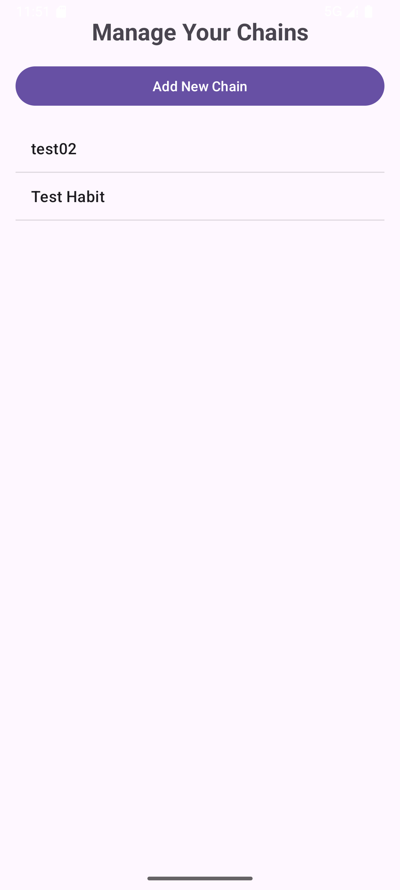

# Unbroken Chain - Habit Tracking App

A simple and effective Android application for tracking daily habits and building unbroken chains of consistency.

## How to use

### main page

click Manage Chains go into Chain setting page
### manage page

then click add chain button to add a new chain

click view calendar check records


## Features

### Core Functionality
- **Calendar View**: Interactive monthly calendar with clickable days
- **Chain Management**: Create and manage multiple habit chains
- **Persistent Storage**: SQLite database for reliable data storage
- **Streak Tracking**: Current and longest streak calculations
- **Months View**: Compact view of multiple months
- **Summary Graph**: Visual statistics with bar charts

### Simple Design
- Clean, modern UI with card-based layout
- Color-coded day indicators (green = completed, blue = today)
- Easy navigation between different views
- Responsive design for different screen sizes

## Technical Implementation

### Database Structure
- **Chains Table**: Stores habit information (id, name, description, created_at, is_active)
- **Entries Table**: Stores daily completion data (id, chain_id, date, completed)

### Key Components
- `ChainDatabase`: SQLite database helper
- `StreakCalculator`: Utility for calculating streaks
- `CalendarViewActivity`: Main calendar interface
- `MonthsViewActivity`: Multi-month view
- `SummaryGraphActivity`: Bar graph visualization

## Getting Started

### Prerequisites
- Android API Level 24+
- Android Studio
- Java 11

### Installation
1. Clone or download the project
2. Open in Android Studio
3. Sync Gradle dependencies
4. Build and run on device/emulator

### Usage
1. **Start the app** - You'll see the main menu
2. **Manage Chains** - Create your first habit chain
3. **Calendar View** - Select a chain and mark completed days
4. **View Statistics** - Check your streaks and progress
5. **Months View** - See patterns across months
6. **Summary Graph** - Visualize your progress over time

## Project Structure

```
app/src/main/java/com/example/unbrokenchainapp/
├── activities/
│   ├── ChainManagementActivity.java
│   ├── CalendarViewActivity.java
│   ├── MonthsViewActivity.java
│   └── SummaryGraphActivity.java
├── database/
│   └── ChainDatabase.java
├── fragments/
│   └── SummaryFragment.java
├── models/
│   ├── Chain.java
│   └── ChainEntry.java
├── utils/
│   ├── StreakCalculator.java
│   └── DatabaseTester.java
└── MainActivity.java
```

## Features Implemented

✅ Calendar View activity with clickable days  
✅ Chain persistent data store  
✅ Months View activity with compact display  
✅ Current streak view  
✅ Longest streak view  
✅ Summaries fragment  
✅ Summary graph activity  
✅ Multiple chains support  

## Debugging

The app includes comprehensive error handling and logging:
- Database operations are tested on startup
- All activities have exception handling
- User-friendly error messages
- Detailed logging for debugging

## Requirements Met

All original requirements have been implemented:
1. ✅ Calendar View activity
2. ✅ Chain persistent data store  
3. ✅ Months View activity
4. ✅ Current streak view
5. ✅ Longest streak view
6. ✅ Summaries fragment
7. ✅ Summary graph activity
8. ✅ Multiple chains support

The app provides a complete habit tracking solution with a focus on reliability and ease of use. 
